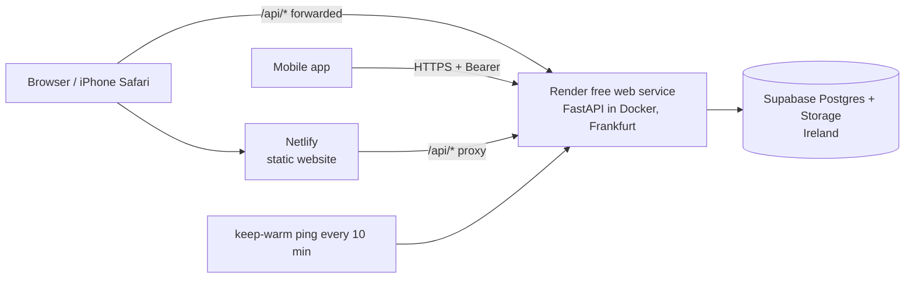

# Plan: mobile app and hosting

Date: 2026-10-04 · Status: **approved, in progress** · Owner: solo developer (learning as we go)

## Progress
| Block | State |
|---|---|
| 0 Foundation | **Done 2026-10-04**: private GitHub repo, first CI run, hermetic tests (the root npm workspace moved to block 1) |
| 1 Shared core package | **Done 2026-10-04**: `@isabella/core` (158 tests), website on it (175 tests), client/endpoint factories and poller, CI on workspaces (PR #1) |
| 2 Backend ready for mobile + Docker | **Done 2026-10-05**: bearer tokens, one-time codes + PKCE (RFC vector verified), redirect allowlist, `auth_codes` table, Dockerfile, smoke-test script, CI `docker` job green (PR #2); 511 backend tests |
| 3 Host the API (Render) | **Done 2026-10-05**: `render.yaml`, ADR 0014, live at https://isabella-api.onrender.com, smoke test 10/10 (PR #3) |
| 4 Website on Netlify + live refresh | **Done 2026-10-05** (iPhone check pending): netlify.toml, /api forwarding, polling, waking notice (PR #4, #5) |
| 5 Mobile skeleton + sign-in | **Done 2026-10-06** (sign-in verified on the iPhone): Expo app, secure token, PKCE sign-in flow, shop list, account screen; 34 mobile tests |
| 6 Mobile shopping | **Done 2026-10-06** (looks good on the iPhone): product page, cart, orders, live refresh, icons/hero; 65 mobile tests |
| 7 Mobile owner tools | **Code done 2026-10-07**, iPhone test pending: Manage tab (dashboard), pieces list/form, camera+library photos, cover/delete, discounts with date pickers, role guard; 104 mobile tests |
| 8 to 10 | Not started |

## 1. Goal
1. A **mobile app** you can test on your iPhone (and Android) that does everything the website does: browse, product pages, sign in with Google, cart, orders, and the owner's tools (pieces, photos, discounts).
2. The same data everywhere: a change on the website appears on the phone **within about 15 seconds**, and the other way round.
3. The whole thing **hosted and reachable from anywhere**, on free tiers, with no card.

Out of scope for now (explicitly pended): Paystack checkout (test mode), the free email provider for welcome / order emails. Checkout therefore stays closed on web and mobile ("parity" means everything the website can do today).

## 2. Decisions made (from your answers) and what they imply
| Topic | Decision | Consequence |
|---|---|---|
| Mobile technology | **Expo (React Native), JavaScript** | Testable on iPhone with the free Expo Go app: no Mac, no Apple account. Shares our tested logic with the web. |
| Devices | iPhone, no Mac (Android too) | No Xcode. Standalone iPhone installs would need a paid Apple account later (explained in block 9). Android can get a real installable APK. |
| Scope of release 1 | **Everything at once** (customer + owner) | Staged into blocks so each is testable; owner tools are the last block before polish. |
| Hosting | **Free, no card** | API on Render's free tier (sleeps when idle, handled in block 3); website on Netlify. |
| Live sync | Within seconds, no manual refresh | Re-fetch on focus, pull-to-refresh, and ~15 s polling on visible screens, on **both** web and mobile. |
| Login | Same Google account, same data on web and mobile | Mobile gets token-based login against the same backend (block 2). |
| Domain | Free subdomains | `*.netlify.app` and `*.onrender.com`; works with Google sign-in. |
| Web host | **Netlify** | Also forwards `/api/*` to the backend so login cookies work on iPhone Safari. |
| Repo | **One monorepo** | See section 3. |
| Payments / email | Pended. Paystack (test mode) replaces Flutterwave; Brevo proposed as the free Mailgun alternative | Recorded in `pending.md`; revisited after block 9. |

## 3. Repository: why one repo, and how it is laid out
**Advice: keep a single monorepo.** One API contract is shared by the backend, website and phone app, and most changes touch several of them at once (a price rule, a new field). One repo means one pull request, one CI run and one set of decision records. Separate repos are worth it only when different teams own different apps or they ship on unrelated schedules.

```
isabella-fashion-finds/
  backend/          FastAPI (exists)
  frontend/         website, Vite (exists)
  mobile/           Expo app (new)
  packages/core/    shared pure logic + API client (new)
  docs/             ADRs and plans
  package.json      npm workspaces: frontend, mobile, packages/*
```
`packages/core` holds what is the same on every client: money formatting, price/sale display rules, cart rules, form validation, time helpers, the error normaliser, and one function per API endpoint on top of a small client factory (cookies on web, bearer token on mobile). The server stays the authority on every price; the clients only display.

Standard practices carried through: tests first, conventional commits, a feature branch + pull request per block with CI green before merging, ADRs for the big decisions, secrets only in environment variables.

## 4. Key designs (so the blocks below make sense)

### 4.1 Login on the phone (token + PKCE)
The website keeps its httpOnly cookie. A phone cannot use that safely, so it gets a **bearer token** from the same backend:
```mermaid
sequenceDiagram
    participant App as Mobile app
    participant Br as In-app browser
    participant API as Backend (via /api)
    participant G as Google
    App->>App: make random code_verifier; code_challenge = SHA256(verifier)
    App->>Br: open /auth/google/login?client=mobile&redirect_uri=APP&code_challenge&state
    Br->>API: start (state kept server side)
    API-->>Br: redirect to Google
    Br->>G: user signs in
    G-->>Br: redirect to /auth/google/callback?code&state
    API->>API: verify state, find/create user, make a ONE-TIME auth code (stored hashed, 2 min, bound to the challenge)
    API-->>Br: redirect to APP?code=...&state=...
    Br-->>App: app regains control with the code
    App->>API: POST /auth/mobile/exchange {code, code_verifier}
    API->>API: check SHA256(verifier) == challenge, unexpired, unused; mark used
    API-->>App: {token, user}
    App->>App: keep the token in the phone's secure storage
    App->>API: every request: Authorization: Bearer <token>
```
Why this shape: no token ever travels in a URL, an intercepted one-time code is useless without the verifier (PKCE), and the redirect target is checked against an allowlist. The token is the same signed, expiring session token the cookie carries, so roles and expiry behave identically.

### 4.2 Hosting layout

- **Why forward `/api/*`:** if the website and API sit on different domains, Safari treats the login cookie as third-party and blocks it. With the forwarding rule the browser only ever talks to the Netlify domain, so the cookie is first-party and works on iPhone.
- **Why Docker:** the same image runs on Render today and Cloud Run / Fly / anywhere later (portability is the standard reason).
- **Cold starts:** Render's free service sleeps after 15 minutes idle (about a minute to wake). A free pinger keeps it awake (one always-on free service fits the 750 monthly hours), and the apps show "waking the server" instead of an error. Free-tier terms change; this is verified in block 3.
- **Region:** Frankfurt, the nearest Render region to the database.

### 4.3 Live sync
No new server technology. Every list/detail screen re-fetches when it becomes visible or the app returns to the foreground, supports pull-to-refresh (mobile), and polls about every 15 s while visible (paused in the background). A shared, unit-tested `createPoller` in `packages/core` does the scheduling. "Immediately" therefore means **seconds**, which is what free hosting can deliver reliably; true instant push (WebSockets) is listed as a later upgrade.

## 5. How every block is done (TDD)
1. Write the failing tests first (pytest for backend; Vitest for shared core and web; Jest + React Native Testing Library for mobile screens).
2. Implement the minimum, refactor, run the whole suite and lint.
3. Verify against the real thing (real database / the deployed service / your phone) with a scripted smoke test, and clean up any test data.
4. Commit in small steps; open a pull request; CI must be green.
5. Write the **walk-through** `.notes/walkthroughs/NN-<name>.md`: what was built, the exact steps for you to follow, what you should see, and troubleshooting. A matching write-up for the milestone goes in `.notes/` as usual.

## 6. Blocks
Each block lists what is built, the tests first, what I need from you, and its walk-through.

### Block 0: foundation (about 30 min)
- **Restore** the stray space that broke `backend/app/domain/pricing.py` (confirm the suite is green again).
- Create a **private GitHub repo** and push (needs your OK, see section 8); confirm the CI workflow runs for the first time and fix anything it finds.
- Set up the root npm workspace and a root README section for the monorepo.
- Tests: the existing 417 backend + 299 frontend tests are the safety net.
- **You:** approve creating/pushing the private repo.
- Walk-through `00-github-and-ci.md`.

### Block 1: shared core package
- Move the pure logic and the API layer from `frontend/src/lib` and `frontend/src/api` into `packages/core` and make the website import `@isabella/core`. Add `createApiClient({ baseUrl, getAuthHeader, credentials })` and `createPoller`.
- Tests first: the moved tests must stay green unchanged in behaviour; new tests for the client factory (cookie mode vs bearer mode, file uploads, error normalisation, 401 handling) and the poller (fake timers: starts, pauses when hidden, stops, backs off on errors).
- Decision recorded: **ADR 0012** (monorepo, shared core, Expo).
- Walk-through `01-shared-core.md`.

### Block 2: backend ready for mobile and production
- Bearer-token support next to the cookie, the PKCE one-time-code flow (new `auth_codes` table, hashed, single use, 2-minute life), redirect allowlist (`isabella://` and, for Expo Go testing, `exp://`), proxy-header handling, Dockerfile + entrypoint that runs migrations, production CORS, and a post-deploy smoke-test script.
- Tests first: token accepted/forged/expired, exchange succeeds once and only once, wrong verifier, expired code, disallowed redirect, cookie flow unchanged, owner/customer roles identical on both transports.
- Decision recorded: **ADR 0013** (mobile authentication). Note: keeping `exp://` allowed is a deliberate testing convenience, protected by PKCE, and is removed before publishing a real build.
- **You:** nothing yet.
- Walk-through `02-mobile-auth-and-docker.md`.

### Block 3: host the backend (Render, free)
- A `render.yaml` blueprint (Frankfurt, Docker, health check `/health`), the environment variables listed in the walk-through (new `SESSION_SECRET`, `APP_ENV=production`, database and Supabase values, Google credentials), the keep-warm ping, and the smoke test against the live URL.
- **You (with my step-by-step):** sign in to Render with GitHub, create the service from the blueprint, paste the secrets into Render's dashboard (never into chat), add the production redirect URI in the Google console and add your iPhone's Google account as a test user.
- Verify: `/health`, `/health/db`, `/products`, Google login round trip, role checks, response times, cold-start behaviour.
- Decision recorded: **ADR 0014** (hosting).
- Walk-through `03-deploy-backend-render.md`.

### Block 4: host the website (Netlify) + live updates on web
- `netlify.toml` with the `/api/*` forwarding rule and the single-page-app fallback; `VITE_API_URL=/api`; web polling and refetch-on-focus; a "waking the server" notice for cold starts.
- Tests first: poller wiring in each page (Vitest/jsdom), the notice, base-URL handling.
- **You:** sign in to Netlify with GitHub, import the repo, set the one environment variable.
- Verify on **iPhone Safari**: the Google login cookie works, refresh of `/products/123` works, a product edited on desktop appears within ~15 s. Also check photo-upload size through the forwarder (flagged risk).
- Walk-through `04-deploy-web-netlify.md`.

### Block 5: mobile app skeleton and sign-in (first iPhone test)
- Expo app in `mobile/` (JavaScript, file-based navigation with Expo Router, Jest + React Native Testing Library), design tokens matching the website, tab layout (Shop, Cart, Orders, Account), API wiring through `@isabella/core`, secure token storage, Google sign-in via the PKCE flow above, sign-out, session restore on launch, offline/error banner.
- Tests first: token storage, the PKCE helper (verifier/challenge, state check), the sign-in state machine (signed-out, signing-in, signed-in, failure), screen rendering.
- **You:** install **Expo Go** from the App Store, create a free **Expo account**, sign in to Expo Go with it, and put the phone on the same Wi-Fi (or use the tunnel option) so you can scan the QR code.
- Verify on your iPhone against the hosted API: sign in with Google, see your name and role, sign out, relaunch and stay signed in.
- Walk-through `05-mobile-skeleton-and-signin.md`.

### Block 6: mobile shopping
- Shop list (cards with "From" prices, sale badge, sold-out), product page (gallery, sizes, size-dependent price, measurements, limit note), add to cart, cart (stepper, notices, problems, subtotal), orders list, pull-to-refresh, polling.
- Tests first: each screen against a mocked API (loading, empty, error, hostile text), plus the shared logic already tested in core.
- Walk-through `06-mobile-shopping.md` (including how to compare web and phone side by side).

### Block 7: mobile owner tools
- Owner-only tabs: pieces list, piece form (one price or per size, measurements, limit per order, visibility), **photos from the phone camera or library**, make-cover/delete, discounts (date and time pickers, scope, status), role guard.
- Tests first: form validation (shared), photo upload payload, role guard, screens with mocked API.
- Walk-through `07-mobile-owner-tools.md`.

### Block 8: live sync and resilience, verified across clients
- Final polling intervals per screen, background pause, consistent error and "waking up" handling, and a scripted two-client check: change a price/stock/discount through the API and confirm both the website and the phone show it within 15 s.
- Walk-through `08-live-sync.md` (a short manual checklist you can run with web and phone side by side).

### Block 9: installing it properly, hardening, wrap-up
- **Android APK: PENDED by the owner (2026-10-07).** Expo Go is the test path for now; the APK build can be done later with Expo's free cloud build.
- **iPhone:** explain the options honestly: keep using Expo Go (free), or pay Apple's $99/year for TestFlight / your own signed build. No Mac is needed either way for the Expo cloud build, but the paid account is mandatory for a standalone iPhone install.
- Hardening: remove the `exp://` allowance when standalone builds are used, rate limiting on `/auth/*`, token revocation list, review of logs and secrets, backup/restore note for Supabase.
- Update ADRs, README, `pending.md`; final write-up.
- Walk-through `09-distribution-and-hardening.md`.

### Block 10 (pended, needs external accounts): Paystack and email
- Paystack **test mode** checkout on web and mobile (redirect/WebView flow), webhook with signature verification and idempotency, then a free transactional email provider (Brevo proposed: 300/day free, single-sender verification without a domain) for welcome and order-confirmation emails. ADR 0015. Scheduled after block 9.

## 7. Order of work for the shortest path to your iPhone
`0 -> 2 -> 3 -> 5 -> 6` gives a testable customer app on your iPhone against a hosted backend. Blocks 1 and 4 run in parallel with that path; 7, 8, 9 follow. Everything stays releasable after each block.

## 8. What I need from you, and when
| When | What | Why |
|---|---|---|
| Block 0 | OK to create a **private** GitHub repo under your account and push the code (the `gh` CLI is already logged in as `sheggz`) | Hosts deploy from a repo, and CI needs one. Nothing secret is committed (`.env` is ignored). |
| Block 3 | A Render account (log in with GitHub); paste secrets into Render's dashboard; add the redirect URI and test users in the Google console | Only you can sign in to those services. I give exact click-by-click steps. |
| Block 4 | A Netlify account (log in with GitHub) | Same. |
| Block 5 | iPhone with **Expo Go**, a free Expo account, same Wi-Fi | To run the app. |
| Block 9 | A decision on the $99/year Apple account (optional) | Only for installing a standalone iPhone build. |

## 9. Risks and how they are handled
| Risk | Handling |
|---|---|
| Render free service sleeps (about a minute to wake) | Keep-warm ping, "waking the server" message, smoke test measures it. |
| Netlify forwarding has request time and body-size limits | Verified in block 4; mobile talks to the API directly, so only website photo uploads could be affected, with a fallback plan ready. |
| Expo Go is a sandbox with limits around sign-in redirects and some native features | The PKCE flow uses the in-app browser and a redirect URL Expo Go supports; proven in block 5. If it ever blocks us, Android and a cloud-built development build are the fallbacks. |
| Expo requires the same free Expo account in Expo Go and on the computer (checked 2026 docs) | Part of block 5 setup. |
| Google consent screen is in "Testing" mode: only listed test users can sign in | Add every tester's Google account in block 3 (or publish the consent screen for basic profile scopes). |
| Free-tier terms change | Dockerised backend and static website move to any host; nothing is tied to one vendor. |
| "Everything at once" is a lot | Blocks are independently testable and releasable; block 7 is the largest and the first candidate to trim if time runs out. |
| Secrets | Only in host dashboards and local `.env`; a new production `SESSION_SECRET`; nothing committed; logs already redact. |

## 10. Definition of done
- The website is live on a public HTTPS address, sign-in works on iPhone Safari, and a piece edited on the website appears on the phone within about 15 seconds (and the reverse).
- The mobile app runs on your iPhone via Expo Go and on an Android phone (APK), signs in with the same Google account, and has full parity with the website, including owner tools.
- All tests green in CI; ADRs 0012-0014 written; a walk-through exists for each block.

## 11. Sources checked while planning
- [Expo Go vs development builds](https://expo.dev/blog/expo-go-vs-development-builds) and [testing on iPhone without a Mac](https://cadrant.ai/blog/expo-go): Expo Go needs no Apple account or Mac, and is a sandbox.
- [Flutter without a Mac](https://blog.codemagic.io/automatic-code-signing-for-ios-that-doesnt-require-a-mac/): needs a paid Apple account for device installs.
- [2026 hosting comparison](https://techsy.io/en/blog/railway-vs-render-vs-fly-io) and [free tiers](https://snapdeploy.dev/blog/free-cloud-deployment-platforms-2026-comparison): Render free tier sleeps after 15 minutes; Fly.io no longer free; Railway is a trial.
- [Email API comparison](https://www.brevo.com/blog/best-email-api/): Brevo 300/day free with single-sender verification; Resend needs a verified domain.
Prices and limits of free tiers change; each is re-checked in the block that uses it.
